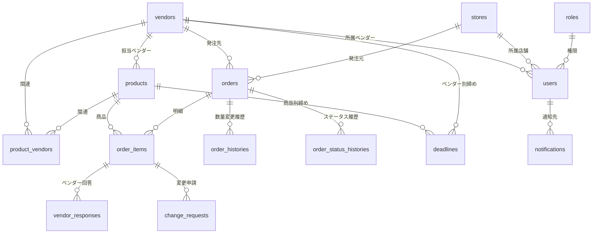
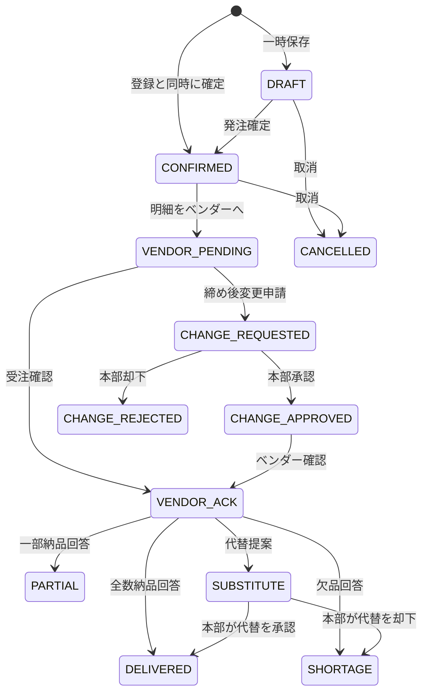

# データベース設計書

## 方針

- 主要テーブルは `created_at` / `updated_at` / `created_by` / `updated_by` を持つ。
- **論理削除を基本**とし、重要な取引履歴は物理削除しない。
  - マスタ・発注は `deleted_at` / `deleted_by` による論理削除。
  - 履歴・ログ（`order_histories` / `order_status_histories` / `vendor_responses` /
    `change_requests` / `audit_logs` / `login_logs` / `notification_logs`）は
    **削除カラムも削除APIも設けていない**（追記のみ）。
- 日時は **UTC の naive datetime** で保存し、表示時に日本時間へ変換する。
  締め時間の設定は日本時間で入力し、保存時に UTC へ変換する。
- 数量は「ケース数」「バラ数」「合計（バラ換算）数量」の3つを保持する。
  `quantity = case_qty × qty_case + qty_loose`

## テーブル一覧

| テーブル | 内容 | 削除方式 |
|---|---|---|
| `roles` | 権限マスタ | 削除しない |
| `users` | ユーザー | 論理削除 |
| `stores` | 店舗マスタ | 論理削除 |
| `vendors` | ベンダーマスタ | 論理削除 |
| `products` | 商品マスタ | 論理削除 |
| `product_vendors` | 商品とベンダーの関連（将来の複数ベンダー対応） | 論理無効化 |
| `deadlines` | 締め時間設定 | 論理削除 |
| `reason_masters` | 変更理由・欠品理由マスタ | 論理削除 |
| `orders` | 発注ヘッダ | 論理削除 |
| `order_items` | 発注明細 | 論理削除 |
| `favorites` | お気に入り商品（店舗単位） | 物理削除可 |
| `order_histories` | 数量変更履歴 | **削除不可** |
| `order_status_histories` | ステータス変更履歴 | **削除不可** |
| `vendor_responses` | ベンダー回答（訂正しても追記で残る） | **削除不可** |
| `change_requests` | 締め後変更申請 | **削除不可** |
| `notifications` | アプリ内通知 | **削除不可** |
| `notification_logs` | 通知送信履歴 | **削除不可** |
| `audit_logs` | 操作ログ | **削除不可** |
| `login_logs` | ログイン履歴 | **削除不可** |
| `idempotency_keys` | 二重送信防止トークン | 期限切れは掃除可 |
| `revoked_tokens` | ログアウト済みトークンの失効リスト | 期限切れは掃除可 |

---

## ER図（主要な関連）



---

## 各テーブルの定義

### roles（権限マスタ）

| カラム | 型 | 内容 |
|---|---|---|
| id | int PK | |
| code | varchar(20) UNIQUE | `ADMIN` / `HQ` / `STORE` / `VENDOR` |
| name | varchar(50) | 表示名 |
| description | varchar(255) | 説明 |

### users（ユーザー）

| カラム | 型 | 内容 |
|---|---|---|
| id | int PK | |
| email | varchar(255) UNIQUE | ログインID |
| password_hash | varchar(255) | **bcrypt ハッシュ。平文は保存しない** |
| name | varchar(100) | 氏名 |
| role_id | int FK→roles | 権限 |
| store_id | int FK→stores NULL可 | 店舗担当者のみ必須 |
| vendor_id | int FK→vendors NULL可 | ベンダー担当者のみ必須 |
| phone | varchar(30) | |
| is_active | bool | 有効・無効（アカウント停止） |
| last_login_at | datetime | 最終ログイン日時 |
| failed_login_count | int | ログイン失敗回数 |
| locked_until | datetime | 一時ロックの解除時刻 |
| password_reset_token | varchar(255) | パスワード再設定トークン |
| password_reset_expires | datetime | トークン有効期限 |
| session_version | int | **セッション版数。**トークンに埋め込み、一致しないトークンを無効とする。パスワード変更・権限変更・アカウント停止で +1 |
| + 監査カラム / deleted_at / deleted_by | | |

**制約**: 管理者・本部には `store_id` / `vendor_id` を割り当てられない。
店舗担当者には `store_id` が、ベンダー担当者には `vendor_id` が必須（API側で検証）。

### stores（店舗マスタ）

| カラム | 型 | 内容 |
|---|---|---|
| id | int PK | |
| code | varchar(20) UNIQUE | 店舗コード |
| name | varchar(100) | 店舗名 |
| address | varchar(255) | 住所 |
| phone | varchar(30) | 電話番号 |
| is_active | bool | 有効・無効 |
| note | text | 備考 |
| + 監査カラム / deleted_at / deleted_by | | |

### vendors（ベンダーマスタ）

| カラム | 型 | 内容 |
|---|---|---|
| id | int PK | |
| code | varchar(20) UNIQUE | ベンダーコード |
| name | varchar(100) | ベンダー名 |
| contact_name | varchar(100) | 担当者名 |
| email | varchar(255) | 連絡先メール |
| phone | varchar(30) | 電話番号 |
| is_active | bool | 有効・無効 |
| note | text | 備考 |
| + 監査カラム / deleted_at / deleted_by | | |

### products（商品マスタ）

| カラム | 型 | 内容 |
|---|---|---|
| id | int PK | 商品ID |
| jan_code | varchar(20) INDEX | JANコード |
| own_code | varchar(30) INDEX | 自社商品コード |
| name | varchar(150) INDEX | 商品名 |
| category | varchar(60) INDEX | 商品分類 |
| spec | varchar(80) | 規格 |
| case_qty | int | ケース入数 |
| order_unit | varchar(10) | `CASE` / `PIECE` / `BOTH` |
| allow_loose | bool | バラ発注可否 |
| cost | numeric(12,2) | 原価 |
| price | numeric(12,2) | 売価 |
| valid_from | date | 適用開始日 |
| valid_to | date | 適用終了日 |
| vendor_id | int FK→vendors | **担当ベンダー（必須。1商品1ベンダー）** |
| is_active | bool | 有効・無効 |
| note | text | 備考 |
| + 監査カラム / deleted_at / deleted_by | | |

### product_vendors（商品とベンダーの関連）

将来の複数ベンダー対応の土台。現状は主ベンダー1件を `is_primary=true` で必ず持つ。

| カラム | 型 | 内容 |
|---|---|---|
| id | int PK | |
| product_id | int FK→products | |
| vendor_id | int FK→vendors | |
| is_primary | bool | 主ベンダーか |
| vendor_product_code | varchar(40) | ベンダー側の商品コード |
| cost | numeric(12,2) | ベンダーごとの原価 |
| is_active | bool | |

**UNIQUE**: (`product_id`, `vendor_id`)

### deadlines（締め時間設定）

適用の優先順位は **PRODUCT > VENDOR > SYSTEM**。
同一 scope 内では `delivery_date` が指定された行（スポット設定）を優先。

| カラム | 型 | 内容 |
|---|---|---|
| id | int PK | |
| scope | varchar(10) | `SYSTEM` / `VENDOR` / `PRODUCT` |
| vendor_id | int FK NULL可 | scope=VENDOR で必須 |
| product_id | int FK NULL可 | scope=PRODUCT で必須 |
| delivery_date | date NULL可 | 特定納品日のみに適用する場合 |
| rough_days_before / rough_time | int / varchar(5) | 概算締め |
| final_days_before / final_time | int / varchar(5) | 最終締め |
| reply_days_before / reply_time | int / varchar(5) | ベンダー回答期限 |
| is_active | bool | |
| note | text | |

### orders（発注ヘッダ）

| カラム | 型 | 内容 |
|---|---|---|
| id | int PK | |
| order_no | varchar(30) UNIQUE | 発注番号 `YYYYMMDD-店舗コード-連番` |
| store_id | int FK→stores INDEX | 店舗 |
| vendor_id | int FK→vendors INDEX | ベンダー |
| delivery_date | date INDEX | 納品日 |
| status | varchar(20) INDEX | ステータス（下記） |
| rough_deadline_at | datetime | 概算締め（UTC） |
| deadline_at | datetime | **最終締め（UTC）。締め判定に使う** |
| reply_deadline_at | datetime | ベンダー回答期限（UTC） |
| note | text | 備考 |
| confirmed_at / confirmed_by | datetime / int | 発注確定日時・確定者 |
| version | int | **楽観ロック用。**更新のたびに +1。クライアントが古い値を送ると 409 |
| + 監査カラム / deleted_at / deleted_by | | |

明細ごとに商品別締めが異なる場合、ヘッダには **最も早い最終締め** を採用する。

`version` は「読んで比較してから書く」のではなく
`UPDATE orders SET version = version + 1 WHERE id = ? AND version = ?` の
更新行数で判定する。同じ値を読んだ2つのリクエストが両方通過して
後勝ちで上書きされるのを防ぐため。

### order_items（発注明細）

| カラム | 型 | 内容 |
|---|---|---|
| id | int PK | |
| order_id | int FK→orders INDEX | |
| product_id | int FK→products INDEX | |
| jan_code / product_name / spec / order_unit / case_qty / cost | | **発注時点のスナップショット**（マスタ変更の影響を受けない） |
| qty_case | int | ケース数 |
| qty_loose | int | バラ数 |
| quantity | int | 合計（バラ換算）数量 |
| confirmed_quantity | int NULL可 | ベンダー回答後の確定数量 |
| status | varchar(20) INDEX | 明細ステータス |
| note | text | 備考 |
| + 監査カラム / deleted_at / deleted_by | | |

### order_histories（数量変更履歴 / 削除不可）

数量が動いたら必ず1行残す。

| カラム | 型 | 内容 |
|---|---|---|
| id | int PK | 履歴ID |
| order_id / order_item_id | int FK | 対象 |
| qty_before / qty_after | int | 変更前・変更後数量 |
| case_before / case_after | int | ケース変更前・変更後 |
| loose_before / loose_after | int | バラ変更前・変更後 |
| reason | text | 変更理由 |
| changed_by | int | 変更者 |
| changed_at | datetime | 変更日時 |
| is_after_deadline | bool | **締め前変更か締め後変更か** |
| change_request_id | int | 紐づく変更申請 |
| requester_id | int | 申請者 |
| approver_id / approved_at | int / datetime | 承認者・承認日時 |
| reject_reason | text | 却下理由 |
| vendor_confirmed_by / vendor_confirmed_at | int / datetime | ベンダー確認者・確認日時 |

### order_status_histories（ステータス変更履歴 / 削除不可）

| カラム | 型 | 内容 |
|---|---|---|
| id | int PK | |
| order_id / order_item_id | int FK | 明細単位の場合は order_item_id を持つ |
| status_before / status_after | varchar(20) | |
| changed_by / changed_at | int / datetime | |
| note | text | 補足（受注確認・変更承認など） |

### vendor_responses（ベンダー回答 / 削除不可）

回答を訂正しても **上書きせず追記** し、最新行に `is_latest=true` を立てる。

| カラム | 型 | 内容 |
|---|---|---|
| id | int PK | |
| order_id / order_item_id / vendor_id | int FK INDEX | |
| response_type | varchar(20) INDEX | `FULL` / `PARTIAL` / `SHORTAGE` / `SUBSTITUTE` / `CHECKING` / `CONSULT` |
| ordered_qty | int | 発注数量 |
| deliverable_qty | int | 納品可能数量 |
| shortage_qty | int | 不足数量 |
| reason | text | 理由（一部納品で必須） |
| shortage_reason | text | 欠品理由（欠品で必須） |
| next_available_date | date | 次回納品可能日 |
| has_substitute | bool | 代替提案の有無 |
| sub_product_name / sub_jan_code / sub_spec / sub_cost / sub_deliverable_qty / sub_delivery_date / sub_comment | | 代替商品提案 |
| sub_approved_by / sub_approved_at | int / datetime | **本部承認**（承認後に確定） |
| sub_rejected_by / sub_rejected_at | int / datetime | 本部却下 |
| comment | text | コメント |
| responder_id / responded_at | int / datetime | 回答者・回答日時 |
| is_latest | bool INDEX | 最新回答フラグ |

### change_requests（締め後変更申請 / 削除不可）

| カラム | 型 | 内容 |
|---|---|---|
| id | int PK | |
| order_id / order_item_id | int FK INDEX | |
| before_case / before_loose / before_quantity | int | **変更前数量を保持** |
| requested_case / requested_loose / requested_quantity | int | 申請数量 |
| reason | text NOT NULL | **変更理由（必須）** |
| status | varchar(20) INDEX | `PENDING` / `APPROVED` / `REJECTED` / `CANCELLED` |
| requester_id / requested_at | int / datetime | 申請者・申請日時 |
| approver_id / approved_at | int / datetime | 承認者・承認日時 |
| reject_reason | text | 却下理由 |
| vendor_confirmed_by / vendor_confirmed_at | int / datetime | ベンダー確認 |

**承認されるまで `order_items.quantity` は書き換えない。**

### notifications / notification_logs（削除不可）

| notifications | 型 | 内容 |
|---|---|---|
| id | int PK | |
| user_id | int FK INDEX | 通知先 |
| type | varchar(30) INDEX | 通知種別 |
| title / body | varchar(200) / text | |
| order_id / order_item_id | int | 関連発注 |
| is_read / read_at | bool / datetime | 既読管理 |
| created_at | datetime | |
| dedup_key | varchar(200) | **重複送信防止キー** |

**UNIQUE**: (`user_id`, `dedup_key`) — 同じ通知を二重に送らない。

| notification_logs | 型 | 内容 |
|---|---|---|
| id | int PK | |
| notification_id | int FK | |
| user_id | int | |
| channel | varchar(10) | `APP` / `EMAIL`（将来 `PUSH` を追加可能） |
| to_address | varchar(255) | 宛先 |
| type | varchar(30) | 通知種別 |
| status | varchar(20) | `SENT` / `SKIPPED` / `FAILED` |
| error | text | 失敗理由 |
| dedup_key | varchar(200) | |
| sent_at | datetime | |

### audit_logs（操作ログ / 削除不可）

| カラム | 型 | 内容 |
|---|---|---|
| id | int PK | |
| user_id / user_email / role_code | | 操作者（削除後も追跡できるよう文字列も保持） |
| store_id / vendor_id | int | 操作者の所属 |
| action | varchar(30) INDEX | 操作種別（下記） |
| target_type / target_id | varchar | 対象 |
| detail | text | JSON形式の詳細 |
| ip_address / user_agent | varchar | |
| created_at | datetime INDEX | |

### login_logs（ログイン履歴 / 削除不可）

| カラム | 型 | 内容 |
|---|---|---|
| id | int PK | |
| user_id | int INDEX | |
| email | varchar(255) INDEX | |
| success | bool | 成功・失敗 |
| failure_reason | varchar(100) | 失敗理由（ユーザー不在／パスワード不一致／ロック中など） |
| ip_address / user_agent | varchar | |
| created_at | datetime INDEX | |

### revoked_tokens（ログアウト済みトークン）

| カラム | 型 | 内容 |
|---|---|---|
| id | int PK | |
| jti | varchar(64) UNIQUE INDEX | トークンの一意ID |
| user_id | int INDEX | |
| expires_at | datetime INDEX | 元トークンの有効期限。過ぎたら削除してよい |
| revoked_at | datetime | 失効日時 |

JWT はサーバー側に状態を持たないため、Cookie を消すだけでは手元のトークンを使い続けられる。
ログアウト時に jti を登録して個別に失効させる。
`users.session_version` がユーザー単位の一括失効、こちらがセッション単位の失効。

### idempotency_keys（二重送信防止）

| カラム | 型 | 内容 |
|---|---|---|
| id | int PK | |
| token | varchar(80) | クライアント発行トークン |
| user_id | int | |
| endpoint | varchar(80) | 対象操作 |
| created_at | datetime | |

**UNIQUE**: (`user_id`, `token`) — 同じトークンの2回目は 409 を返す。

---

## 区分値一覧

### 発注ステータス（orders.status / order_items.status）

| コード | 表示名 |
|---|---|
| `DRAFT` | 下書き |
| `PLANNED` | 発注予定 |
| `CONFIRMED` | 発注確定 |
| `VENDOR_PENDING` | ベンダー未確認 |
| `VENDOR_ACK` | ベンダー確認済み |
| `PARTIAL` | 一部納品 |
| `SHORTAGE` | 欠品 |
| `SUBSTITUTE` | 代替提案 |
| `DELIVERED` | 納品確定 |
| `CHANGE_REQUESTED` | 変更申請中 |
| `CHANGE_APPROVED` | 変更承認済み |
| `CHANGE_REJECTED` | 変更却下 |
| `CANCELLED` | 取消 |

### ステータス遷移

**直接編集・取消の可否**

| ステータス | 締め前の数量直接編集 | 取消 |
|---|:-:|:-:|
| 下書き / 発注予定 / 発注確定 / ベンダー未確認 / ベンダー確認済み | ○ | ○ |
| 一部納品 / 欠品 / 代替提案 / 納品確定 | × （409） | 本部・管理者のみ |
| 変更申請中 / 変更承認済み / 変更却下 | × （409） | 本部・管理者のみ |
| 取消 | × | × |

ベンダーが納品可否を回答した後に数量だけ書き換わると回答の前提が崩れるため、
締め前であっても直接編集させない。



### ベンダー回答区分（vendor_responses.response_type）

| コード | 表示名 | 必須入力 |
|---|---|---|
| `FULL` | 全数納品可能 | — |
| `PARTIAL` | 一部納品可能 | 納品可能数量、理由 |
| `SHORTAGE` | 欠品 | 欠品理由 |
| `SUBSTITUTE` | 代替商品提案 | 代替商品名、納品可能数量 |
| `CHECKING` | 確認中 | — |
| `CONSULT` | 要相談 | — |

### 操作ログ種別（audit_logs.action）

`LOGIN` / `LOGIN_FAILED` / `LOGOUT` / `ORDER_CREATE` / `ORDER_UPDATE` / `ORDER_CONFIRM` /
`ORDER_CANCEL` / `CHANGE_REQUEST` / `CHANGE_APPROVE` / `CHANGE_REJECT` / `VENDOR_RESPONSE` /
`VENDOR_SHORTAGE` / `VENDOR_SUBSTITUTE` / `EXPORT_EXCEL` / `EXPORT_CSV` / `EXPORT_PDF` /
`MASTER_CHANGE` / `USER_SUSPEND`

### 通知種別（notifications.type）

`ORDER_CREATED` / `ORDER_QTY_CHANGED` / `DEADLINE_24H` / `DEADLINE_1H` / `ORDER_CONFIRMED` /
`VENDOR_UNCONFIRMED` / `VENDOR_REPLY_OVERDUE` / `PARTIAL_DELIVERY` / `SHORTAGE` / `SUBSTITUTE` /
`CHANGE_REQUESTED` / `CHANGE_APPROVED` / `CHANGE_REJECTED` / `DELIVERY_FIXED`

---

## PostgreSQL への移行

`DATABASE_URL` を差し替えるだけで移行できます。

```dotenv
DATABASE_URL=postgresql+psycopg://order_user:パスワード@db:5432/order_app
```

移行時に注意する点:

- SQLite 固有の型は使っていません（`Numeric` / `Date` / `DateTime` / `Boolean` のみ）。
- 外部キー制約は SQLite でも `PRAGMA foreign_keys=ON` で有効化しており、挙動差を減らしています。
- スキーマ適用は Alembic で行います。

```bash
alembic upgrade head
```
